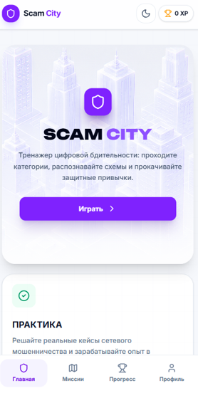
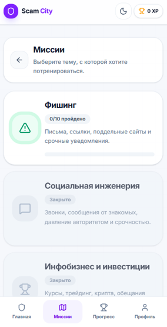
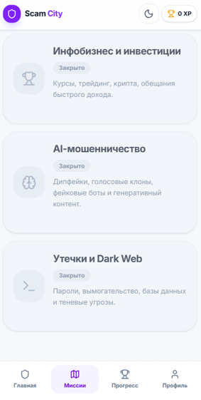
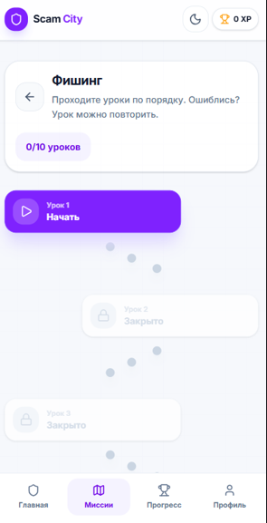
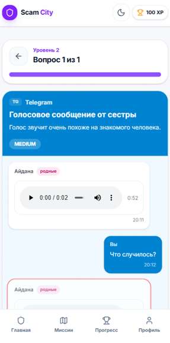
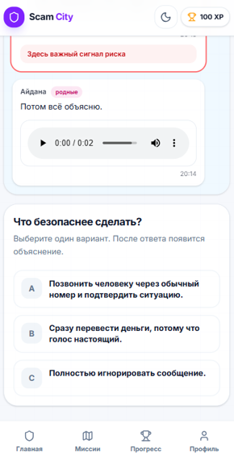
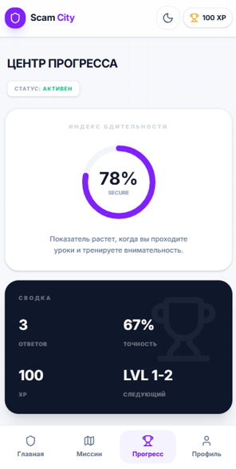
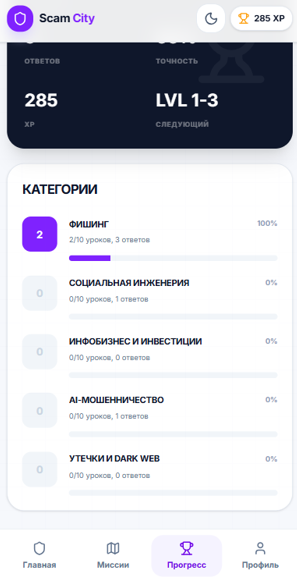
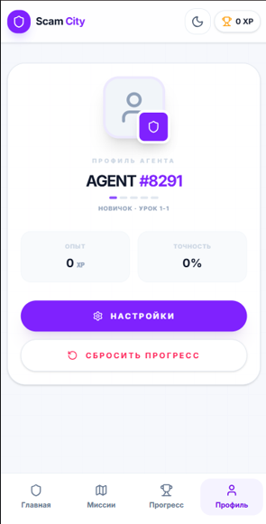

# ScamCity

**ScamCity** — интерактивный frontend-тренажер по цифровой безопасности. Проект помогает пользователям распознавать фишинг, социальную инженерию, мошенничество в маркетплейсах, подозрительные сообщения, AI-голоса/deepfake-сценарии и другие схемы онлайн-обмана через короткие миссии и адаптивные задания.

Проект занял **2-е место на Республиканском хакатоне по ИИ и кибербезопасности** в мае 2026 года.

> **Важно:** backend хакатонной версии может быть отключен или недоступен. Для портфолио и демонстрации frontend можно запускать без backend: на моковых данных, локальном JSON, Firebase или в отдельном demo mode.

## Моя роль

**Frontend Developer / Team Coordinator**  
**Бишкек, Кыргызстан**

- Руководила командой и координировала разработку хакатонного MVP.
- Разрабатывала frontend тренажера цифровой безопасности на React и TypeScript.
- Реализовала пользовательские сценарии, интерактивные задания и адаптивный интерфейс.
- Участвовала в интеграции Firebase и AI-функциональности проекта.
- Подготовила проект к презентации и защите перед жюри.

## Стек

- React
- TypeScript
- Vite
- Redux Toolkit
- Firebase / Firestore / Firebase Hosting
- REST API
- Axios
- Tailwind CSS
- Motion
- Git / GitHub

## Скриншоты

### Главная страница



### Категории миссий





### Цепочка уровней



### AI/deepfake сценарий с голосовыми сообщениями



### Выбор ответа в миссии



### Центр прогресса





### Профиль



## Реализованные функции

- Адаптивный frontend для desktop и mobile.
- Категории миссий и Duolingo-style цепочка уровней.
- Первый диагностический уровень.
- Адаптивные AI-миссии после диагностики.
- Интерактивные задания с вариантами ответов.
- Chat-style сценарии для социальной инженерии и AI-мошенничества.
- Поддержка изображений, аудио/voice и видео в сценариях.
- XP-система и локальное сохранение прогресса.
- Логика завершения и открытия уровней.
- Модалка результата с количеством правильных ответов и рекомендациями.
- Профиль пользователя и экран прогресса.
- Светлая и темная темы.
- Firebase конфигурация и hosting setup.
- REST API слой через Axios.
- Redux Toolkit modules для данных, подключаемых к серверу.
- Архитектура, которую можно переключить на demo mode без backend.

## Frontend demo без backend

Если backend недоступен, frontend можно показать одним из способов:

1. **Mock data** — заменить ответы API локальными объектами.
2. **Local JSON** — хранить сценарии в `src/data/` и читать их вместо API.
3. **Firebase** — загрузить demo-сценарии из Firestore.
4. **Demo mode** — добавить env-флаг `VITE_DEMO_MODE=true` и переключать API слой на локальные данные.

Пример `.env` для демонстрации:

```env
VITE_DEMO_MODE=true
VITE_API_URL=
VITE_API_BASE_URL=
```

В demo mode приложение должно:

- загружать диагностические вопросы из локальных данных;
- загружать adaptive сценарии из локальных данных;
- сохранять XP и прогресс в `localStorage`;
- не отправлять запросы на отключенный backend.

## Предупреждение об отключенном backend

Backend хакатонной версии использовался для:

- загрузки категорий и сценариев;
- отправки ответов пользователя;
- сохранения прогресса и analytics;
- генерации адаптивных AI-сценариев.

Если backend выключен, ngrok-ссылка изменилась или сервер недоступен, запросы могут возвращать `404`, `500` или CORS-ошибки. Это не означает, что frontend сломан. Для портфолио лучше использовать demo mode или подключить новый backend URL через переменные окружения.

## API configuration

Создайте `.env`, если хотите подключить backend:

```env
VITE_API_URL=https://your-backend-url
VITE_API_BASE_URL=https://your-backend-url
```

Swagger/docs обычно открывается по адресу:

```txt
https://your-backend-url/docs
```

Но во frontend нужно указывать базовый URL backend без `/docs`.

Правильно:

```txt
https://your-backend-url
```

Неправильно:

```txt
https://your-backend-url/docs
```

## Запуск frontend

Установить зависимости:

```bash
npm install
```

Запустить dev server:

```bash
npm run dev
```

Открыть:

```txt
http://localhost:3000
```

Собрать production build:

```bash
npm run build
```

Посмотреть production build локально:

```bash
npm run preview
```

Проверить TypeScript:

```bash
npm run lint
```

## Firebase Hosting

В проекте есть Firebase конфигурация:

- `.firebaserc`
- `firebase.json`
- `firestore.rules`
- `firestore.indexes.json`

Deploy на Firebase Hosting:

```bash
npm run firebase:deploy
```

Deploy только Firestore rules:

```bash
npm run firebase:rules
```

## Структура проекта

```txt
src/
  api/              Axios client и API configuration
  app/              app hooks, store, router, game/progress controller
  assets/           images и icons
  components/       UI components и screens
  modules/          Redux Toolkit feature modules
  utils/            helper functions
api/                serverless/API-related files
scripts/            Firestore seed scripts
dist/               production build
```

## GitHub

Repository: [github.com/kalybekovanurai/ScamCity](https://github.com/kalybekovanurai/ScamCity)

## Achievement

**ScamCity — 2-е место на Республиканском хакатоне по ИИ и кибербезопасности**  
Май 2026

Проект был создан как hackathon MVP для обучения цифровой безопасности через AI-assisted сценарии и интерактивные задания.

